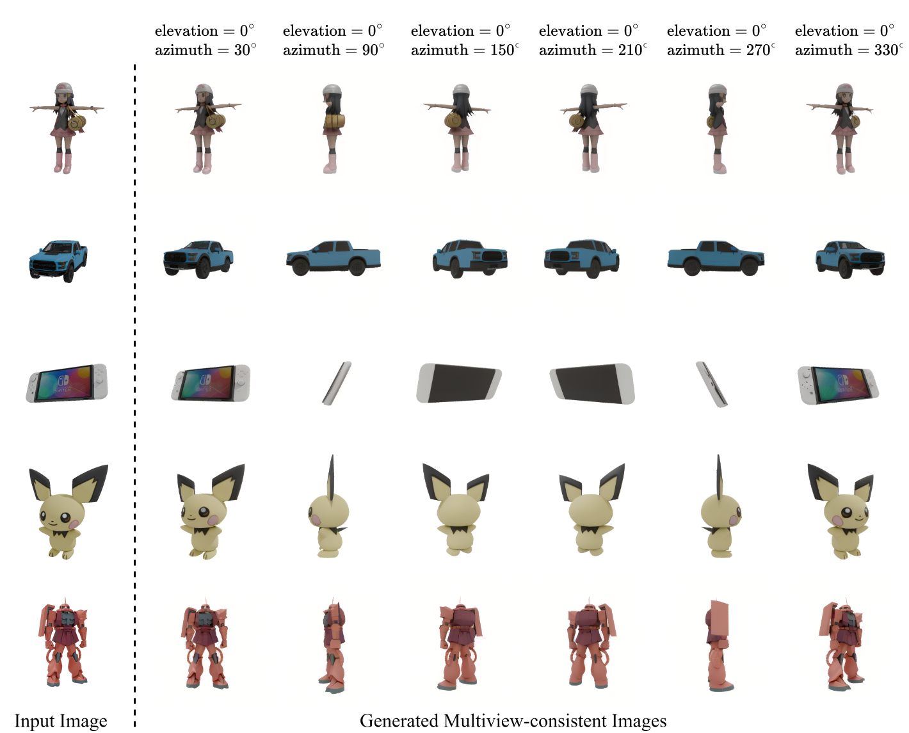

# GeoMVD




<p style="text-align: center;">GeoMVD performs excellently on single-image–driven multi-view three-dimensional generation, is compatible with real photographs, synthesized images, and two-dimensional illustrations, and maintains cross-view consistency and high qualitycentered.</p>

## Dependencies and Installation

```bash
conda create --name GeoMVD python=3.10
conda activate GeoMVD

# Install PyTorch
pip install torch==2.6.0 torchvision==0.21.0 torchaudio==2.6.0 --index-url https://download.pytorch.org/whl/cu124

# Install other requirements
pip install -r requirements.txt
```

## How to Use

### Download the models

- [To-Hitori/GeoMVD at main](https://huggingface.co/To-Hitori/GeoMVD/tree/main/GeoMVD)
- [stabilityai/stable-diffusion-2 · Hugging Face](https://huggingface.co/stabilityai/stable-diffusion-2)
- [lemonaddie/Geowizard · Hugging Face](https://huggingface.co/lemonaddie/Geowizard)

### step1 Generate Geo Image

```bash
cd GIEM
# 1. Open run.py and modify the input and output paths.
# Format of the input path
# INPUT_PATH
# 	- image1.png
#   - image2.png
#   - ...
# The OUTPUT_PATH will be created at the location you specify.

# 2. Open GeoMVD\GIEM\src\run_geowizard.py and modify the path to the relevant weights.

python run.py
# Get the output image at OUTPUT_PATH
```

### step2 Generate Multi View Image

```python 
cd ../
# Open run_geomvd.py and modify the parameter pipeline_input to be OUTPUT_PATH from step1.
# Modify ckpt_path to the location where you downloaded the weights.
python run_geomvd.py
# The output result can be found at the corresponding location in OUTPUT_PATH.
```


## Acknowledgements

We thank the authors of the following projects for their excellent contributions to 3D generative AI!

- [Zero123++](https://github.com/SUDO-AI-3D/zero123plus)

- [InstantMesh](https://github.com/TencentARC/InstantMesh)

- [Era3D](https://github.com/pengHTYX/Era3D)

  


